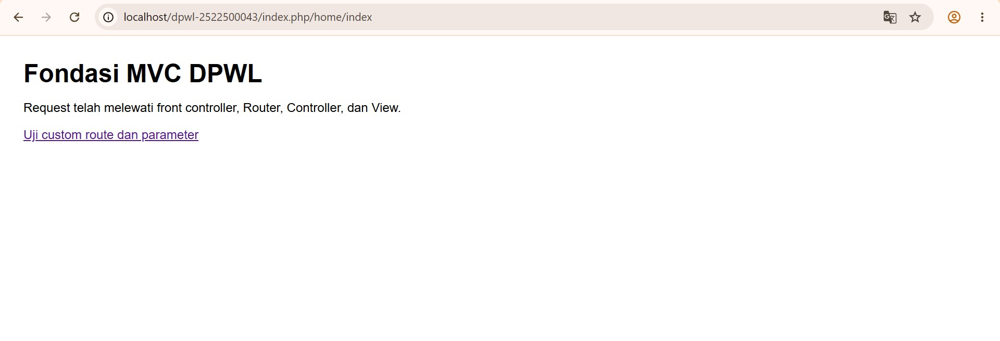
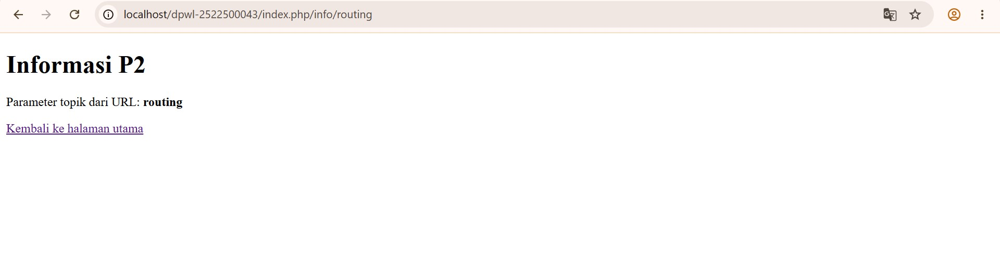

# pertemuan-02

# Pertemuan 02 - Fondasi MVC Buatan Sendiri

## 1. Tujuan Praktikum
Tujuan praktikum P2 adalah memahami dan menerapkan fondasi MVC (Model-View-Controller) sederhana yang dibuat sendiri, mulai dari proses request melalui index.php sebagai front controller, pemetaan URL menggunakan Router, pemanggilan Controller dan method, hingga menampilkan hasil melalui View. Praktikum ini juga bertujuan memahami penggunaan route, parameter URL, helper base_url() dan site_url(), serta melakukan pengujian dan debugging pada aplikasi.
## 2. Struktur Direktori
```
dpwl-2522500043/
├── index.php
├── application/
│   ├── config/
│   │   ├── config.php
│   │   └── routes.php
│   ├── controllers/
│   │   └── Home.php
│   ├── helpers/
│   │   └── url_helper.php
│   └── views/
│       └── home/
│           ├── index.php
│           └── info.php
├── assets/
│   └── css/
│       └── app.css
└── system/
    └── core/
        ├── Controller.php
        └── Router.php
```
Fungsi setiap bagian:

* index.php → sebagai front controller yang menjadi pintu masuk utama setiap request dan meneruskannya ke Router.
* application/ → berisi komponen utama aplikasi P2.
    * config/ → menyimpan konfigurasi aplikasi dan pengaturan route.
        * config.php → berisi konfigurasi dasar aplikasi.
        * routes.php → menentukan default_controller dan custom route.
    * controllers/ → berisi Controller yang menangani request dari pengguna.
        * Home.php → memiliki method index() dan info($topik).
    * helpers/ → berisi fungsi pembantu aplikasi.
        * url_helper.php → menyediakan fungsi seperti base_url() dan site_url().
    * views/ → berisi tampilan yang ditampilkan kepada pengguna.
        * home/index.php → tampilan halaman utama.
        * home/info.php → tampilan informasi P2 dan parameter topik.
* system/ → berisi komponen inti MVC yang dibuat sendiri.
    * Controller.php → menyediakan method view() untuk memanggil View.
    * Router.php → memetakan URL ke Controller, method, dan parameter serta menangani route yang tidak ditemukan.

## 3. Front controller
index.php berperan sebagai satu titik masuk utama (front controller) dalam aplikasi P2. Setiap request dari pengguna masuk terlebih dahulu melalui index.php. File ini memuat konfigurasi, helper, Controller, dan Router, kemudian mengambil URI dari request dan meneruskannya ke Router untuk diproses. Selanjutnya, Router menentukan Controller, method, dan parameter yang sesuai sebelum menjalankan request tersebut.

## 4. Routing dan Pemetaan URL
| URL/Route | Controller | Method | Parameter | View |
|---|---|---|---|---|
| / | Home | index | - | home/index.php |
| home/index | Home | index | - | home/index.php |
| home/info/mvc | Home | info | mvc | home/info.php |
| info/routing | Home | info | routing | home/info.php |
| pasien/001 | Home | pasien | 001 | home/pasien.php |

Route pasien/001 dipetakan oleh Router ke Home::pasien('001'). Method pasien() menerima parameter nomor pasien dan meneruskannya ke View home/pasien.php. View kemudian menampilkan nomor pasien berdasarkan parameter dari URL. Route ini dibuat sebagai modifikasi berdasarkan konteks aplikasi Rumah Sakit.

## 5. Base URL dan Helper
base_url() digunakan untuk menghasilkan URL dasar aplikasi, terutama untuk mengakses file aset seperti CSS, JavaScript, atau gambar. Pada implementasi P2, base_url() digunakan untuk memanggil file assets/css/app.css.

Contoh: 
`<link rel="stylesheet" href="<?= base_url('assets/css/app.css') ?>">`

Sedangkan site_url() digunakan untuk membentuk URL navigasi atau route aplikasi berdasarkan routing yang telah dibuat.

Contoh:
`<a href="<?= site_url('info/routing') ?>">
    Uji custom route dan parameter
</a>`

Dengan demikian, base_url() digunakan untuk mengakses aset aplikasi, sedangkan site_url() digunakan untuk membuat URL menuju route aplikasi.

## 6. Alur Request-response
Jelaskan dua alur berikut:


1. Alur eksekusi aktual P2:
Browser → index.php → Router → Controller → View → Response.

    jawaban:
Pada implementasi P2, setiap request dari browser masuk melalui index.php sebagai front controller. Selanjutnya, index.php meneruskan URI kepada Router. Router menentukan Controller, method, dan parameter yang sesuai berdasarkan route yang tersedia. Controller kemudian menjalankan method yang diminta dan memanggil View untuk menampilkan hasil kepada pengguna. Setelah View diproses, hasilnya dikirim kembali sebagai response ke browser.

2. Posisi Model dalam arsitektur MVC lengkap:
Browser → index.php → Router → Controller → Model → basis data/data → Model → Controller → View → Response.

    jawaban:
Dalam arsitektur MVC lengkap, Model berfungsi sebagai bagian yang menangani akses dan pengelolaan data. Setelah Controller menerima request, Controller dapat meminta Model mengambil atau mengolah data dari basis data. Hasil pengolahan tersebut dikembalikan ke Controller, kemudian diteruskan ke View untuk ditampilkan kepada pengguna.


Pada implementasi P2, Model belum digunakan karena akses dan pengelolaan basis data mulai
diimplementasikan pada P3.
## 7. Hasil Pengujian dan Debugging
Catat skenario pengujian valid dan tidak valid beserta hasilnya. Jika ditemukan kesalahan selama
implementasi, dokumentasikan sekurang-kurangnya satu proses debugging yang memuat:
Gejala → Penyebab → Perbaikan → Hasil Uji Ulang
Jika seluruh implementasi langsung berjalan sesuai hasil yang diharapkan, jelaskan hasil pemeriksaan
sintaks dan pengujian yang telah dilakukan.

    jawaban:
Proses debugging yang ditemukan:

* Gejala: Halaman info/routing tidak menampilkan isi atau terlihat kosong.
* Penyebab: Terdapat kesalahan penulisan PHP opening tag pada routes.php, yaitu <? php sehingga file tidak diproses dengan benar.
* Perbaikan: Mengubah penulisan menjadi <?php dan menyimpan perubahan pada file.
* Hasil uji ulang: Route /index.php/info/routing berhasil dijalankan dan menampilkan “Parameter topik dari URL: routing”.

## 8. Bukti Tangkapan Layar
Sisipkan gambar yang relevan dari folder dokumentasi/ dengan perintah:
### Gambar 1. Hasil Pengujian Halaman Utama

### Gambar 2. Hasil Pengujian Custom Route

## 9. Kesimpulan P2

Pada P2, kerangka MVC sederhana yang dibuat sendiri sudah dapat digunakan untuk menangani request melalui index.php sebagai front controller, melakukan pemetaan URL menggunakan Router, memanggil Controller dan method beserta parameter, serta menampilkan hasil melalui View. P2 juga sudah menerapkan custom route, penggunaan base_url() dan site_url(), penanganan 404, serta pengujian dan debugging dasar.

Pada P3, kerangka MVC akan dikembangkan dengan menambahkan Model dan mulai menerapkan akses serta pengelolaan data dari basis data. Dengan demikian, Controller nantinya dapat berinteraksi dengan Model untuk mengambil atau mengolah data sebelum hasilnya diteruskan ke View.
